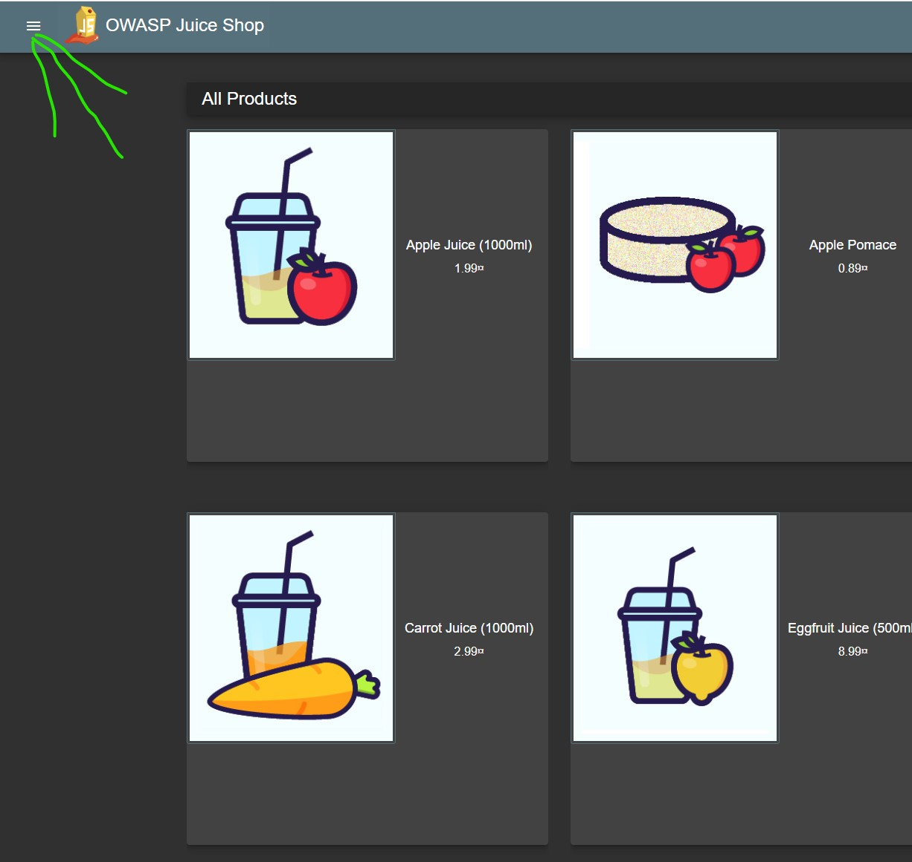
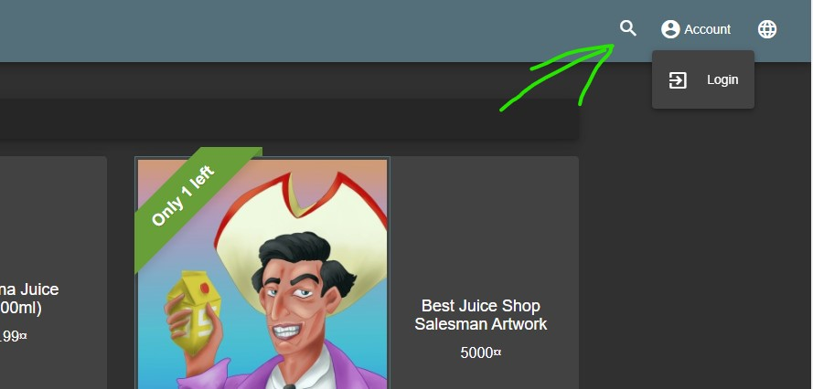

# Getting to know the application

## prerequisite
The hackerlab setup must be comleted, as specified in the [Readme file](../README.md)

## The basic application
Juice shop is more or less a standard webshop. In the upper
right  corner there is a dropdown menu which unfolds the navigation
panes of the site.  

  
In the upper right corner a search bar can be found, along with 
langauge options and the authentication feature (login).  

  
Other then that, the application is pretty basic,so you should start
exploring it by yourself.