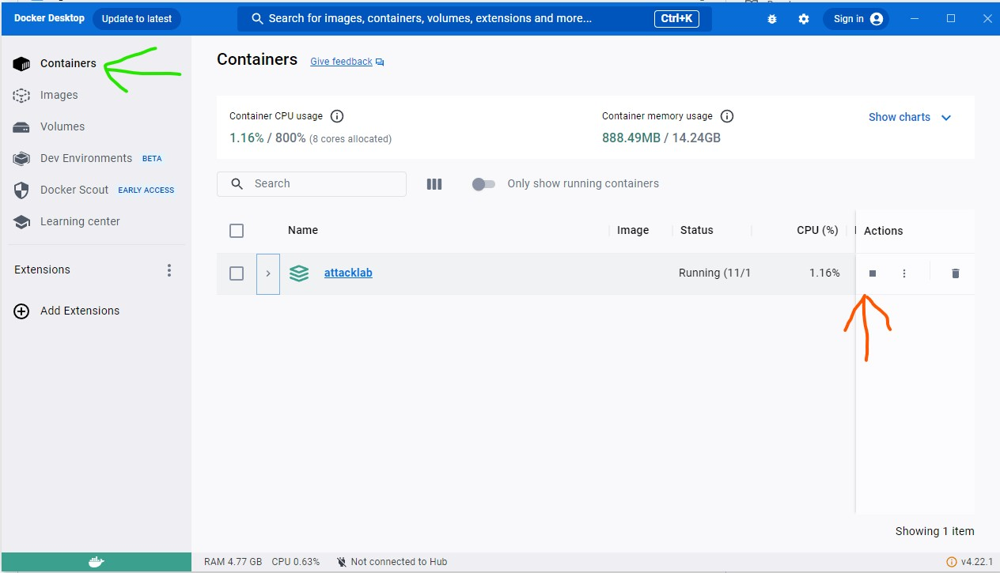

# 🛠️ Web Application Security – Introduction Lab Setup

The purpose of this lab is to establish an environment suitable for basic introductory exercises in web application security.  
The primary focus of these exercises is on API vulnerabilities, aiming to raise awareness of the potential security gaps that may occur.  
The objective is to create a general understanding of these vulnerabilities and to offer a basic introduction to approaches and tools used for testing.  
  
⚠️ It's important to note that these exercises are not intended as part of pentesting training, but merely for a basic introduction to tools and vulnerabilities.  
  
These foundational labs will prepare you for more advanced exercises involving real-world API attack scenarios and testing workflows.

The lab comprises several intentionally vulnerable applications, each accompanied by a ready-to-use Docker Compose file.

The projects used in this lab include:  
- Juice Shop: [https://github.com/bkimminich/juice-shop](https://github.com/bkimminich/juice-shop)  
- Completely Ridiculous API (crAPI): [https://github.com/OWASP/crAPI](https://github.com/OWASP/crAPI)  
- Damn Vulnerable Web Application (DVWA): [https://github.com/digininja/DVWA](https://github.com/digininja/DVWA)
  
### 🎯 Learning Objectives
- Set up a secure, isolated environment for API security testing.
- Become familiar with Docker Compose and container management.
- Gain initial exposure to vulnerable web applications (crAPI, Juice Shop, DVWA).
- Prepare for hands-on API exploitation exercises.

# 🚀 Getting started

👩‍🎓 **Learning Differentiation**  
Different students learn at different paces — and that’s okay.  
For some of you, tools like Docker, PowerShell, or Git may be entirely new. That’s expected and fully part of the learning curve.  
Cybersecurity is a complex field, and it's important to develop confidence with foundational tools and practices before diving into more advanced topics. Take your time — learning the basics well is key to long-term success.

## 🧪 Test environment

All shown configurations are tested in the following environment:

| Component            | Version           | Details                                                                     |
| -------------------- | ----------------- | --------------------------------------------------------------------------- |
| **Operating System** | Windows 11 Pro    | Version: 10.0.26100<br>Build: 26100                                         |
| **Docker Client**    | 27.3.1            | API version: 1.47<br>Go version: go1.22.7<br>Git commit: ce12230            |
| **Docker Server**    | 27.3.1            | API version: 1.47 (min 1.24)<br>Go version: go1.22.7<br>Git commit: 41ca978 |
| **Docker Desktop**   | 4.36.0            | Build: 175267                                                               |
| **Docker Compose**   | v2.30.3-desktop.1 | Included with Docker Desktop                                                |
| **containerd**       | 1.7.21            | Git commit: 472731909fa34bd7bc9c087e4c27943f9835f111                        |
| **runc**             | 1.1.13            | Git commit: v1.1.13-0-g58aa920                                              |
| **docker-init**      | 0.19.0            | Git commit: de40ad0                                                         |

## 🐳 Setting up the lab
For convenience, the lab is deployed using [Docker Compose](https://docs.docker.com/compose/), requiring both Docker and Docker Compose for usage.  
For Windows users, you can easily set up the lab by following [the installation instructions for Docker Desktop](https://docs.docker.com/desktop/install/windows-install/), which include the installation of both Docker and Docker Compose.
   
Linux users can follow the instructions for [installing Docker on Linux](https://docs.docker.com/desktop/install/linux-install/) and, subsequently, the guidelines for [installing Docker Compose on Linux](https://docs.docker.com/compose/install/linux/).

▶️ A Docker Desktop setup video guide can be found [here](https://www.youtube.com/watch?v=7y50rZItKCQ)

You’ll be using Docker primarily through the command line, but the Docker Desktop GUI can be helpful for managing containers visually.

### 📥 Clone the project
You can clone this entire repository to your local PC using [Git](https://git-scm.com/),  
or you can simply copy-paste the contents of the [docker-compose.yml file](./docker-compose.yml) to a file with a .yml extension on your local PC.

📚 A guide for cloning a GitHub repository using Git can be found [here](https://docs.github.com/en/repositories/creating-and-managing-repositories/cloning-a-repository)

### 📦 Deploy the lab to Docker
Inside the folder which contains the `docker-compose.yml` file (the cloned project from GitHub), execute the command  
```
docker-compose -f docker-compose.yml --compatibility up -d
```
using PowerShell (or Bash for Linux users).

🧭 You can find the guide [Starting Windows PowerShell here](https://learn.microsoft.com/en-us/powershell/scripting/windows-powershell/starting-windows-powershell?view=powershell-7.4), and a video for navigating PowerShell [here](https://www.youtube.com/watch?v=gd1GT5gfIPk).

🌐 Now, you should be able to access the Juice Shop website at the URL [http://127.0.0.1:3000](http://127.0.0.1:3000) and the crAPI website at the URL [https://127.0.0.1:8443](https://127.0.0.1:8443).  
  
🛡️ Note: Accessing crAPI at https://127.0.0.1:8443 may trigger a browser security warning due to a self-signed certificate.  
This is normal for a local test environment — you can safely bypass the warning.
  
✅ **Verify Setup:** Open [http://127.0.0.1:3000](http://127.0.0.1:3000).  
You should see the Juice Shop login screen.

🧰 You can get a full description of the `docker-compose up` command [here](https://docs.docker.com/engine/reference/commandline/compose_up/)

### 🔻 Remember to shut down the service when not in use.

Remember to shut down the services when the applications are not in use.  
Either use the command `docker-compose down` from within the folder that contains the `docker-compose.yml` file  
or shut them down using the Docker GUI.

🧹 To remove all containers, networks, and images created by Docker Compose, run:
```
docker-compose down --volumes --rmi all
```



## 🧭 General Introduction to the Applications

The general introduction for each of the applications can be found here:

| Application  | Link  | 
|---|---|
|crAPI|[Getting to know the application](crAPI/1_Getting_To_Know_the_Application.md)|
|Juice Shop|[Getting to know the application](JuiceShop/1_Getting_To_Know_the_Application.md)|
|DVWA|Yet to come|

📚 The intention is to start with the crAPI exercises, and once those are completed, you can move on to the Juice Shop exercises.  
Both applications contain exercises in the same category and with the same tools, so the Juice Shop exercises serve as reinforcement, allowing you to apply the same tools and techniques in a different application context.

⚖️ **Ethical Reminder:** These labs are for educational use only.  
Never test real systems without explicit permission.

## 📊 Service ports used.

| Service  | Port  | 
|---|---|
| Damn Vulnerable Web Application  | 4280  |
| Juice Shop  | 3000  |
| api.mypremiumdealership.com | 8443  |
| crapi-identity| Not exposed by default — to enable, remove the comment tags (#) in docker-compose.yml and re-run the deployment. |
| crapi-community | Not exposed by default — to enable, remove the comment tags (#) in docker-compose.yml and re-run the deployment. |
| crapi-workshop  | Not exposed by default — to enable, remove the comment tags (#) in docker-compose.yml and re-run the deployment.|
| crapi-web | HTTP: 8888 HTTPS: 8443  |
| mailhog | 8025  |
