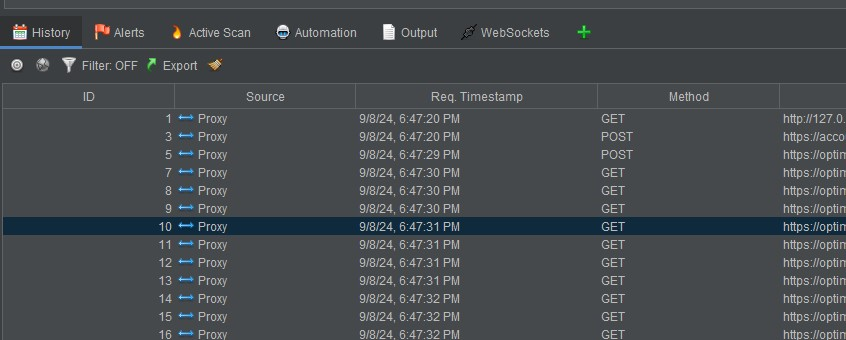

The purpose of this guide is to give a basic introduction to the tool Zed Attack Proxy(ZAP).  
  
There are two major tools for proxying and analyzing browser and API interactions.  
One is the commercial product [Burp Suite](https://portswigger.net/burp), which has a free community edition with limited functionality (e.g., no auto scans, request throttling, etc.).  
The other is [Zed Attack Proxy (ZAP)](https://www.zaproxy.org/), an [open source project](https://github.com/zaproxy/zaproxy) driven by the [Open Web Application Security Project (OWASP)](https://owasp.org/), and is therefore free to use in a fully featured version.  
  
**Software and its documentation change over time. If the guide provided here has become outdated, you can always find the latest documentation for ZAP [here](https://www.zaproxy.org/docs/).**  
  
# Prerequisites  
You will perform an automated scan against Juice Shop, so before following the steps, make sure you have the lab running, with Juice Shop on port 3000.  
You should also have installed either Firefox or Chrome browser on your PC and have it updated to the latest version.  
  
# Basic ZAP Usage  
This guide introduces the basic use of ZAP.  
The official guide for getting started with ZAP can be found [here](https://www.zaproxy.org/getting-started/?ref=blog.gitguardian.com).  
  
In my opinion, the main advantage of using ZAP instead of Burp Suite is the price. ZAP is fully featured and free, whereas only the Burp Suite Community Edition is free, with limited features. However, Burp Suite is much more user-friendly for beginners (the intended audience of this repo). But if you're up for the challenge, ZAP has many great features once you get the hang of it.  
  
This is merely a very basic introduction to ZAP. Please explore it further in the [official documentation](https://www.zaproxy.org/docs/).  
  
## 1. Installing ZAP

- Download the installer for your operating system [here](https://www.zaproxy.org/download/), and follow the installation wizard.  
_Choose the standard install option._  

- After installation, start ZAP to verify that it is working correctly.  
_When asked if you want to persist the session, just select no._  
  
**Over the years, I've experienced various browser driver issues (e.g., Selenium driver), which can cause problems at times. If you experience any, try restarting your computer.**  

## 2. Updating Selenium and browser drivers
When i have experienced issues between ZAP and browsers, it have often been outdated drivers that have caused the issues.
To avoid this, ensure that the drivers are updated to latest version.

- Click the _Check for updates_ button.  
  
  
- Check if _Selenium_ or _Windows WebDrivers_ can be updated  
  
  
## 3. Running an Automated Scan  
ZAP can perform automated scans for potential vulnerabilities against websites and the APIs used by these websites.  
  
**If you experience any driver issues, try restarting your PC if this is the first time running the automated scan after installing ZAP.**

- Select the _Quick Start menu_ by clicking _View -> Show Tab -> Quick Start Tab_.  
  

- Select the now visible _Quick Start Tab_, configure the automated scan as shown in the picture below, and click _Attack_.  
    
  _If you experience any issues related to the chosen browser, try restarting your PC (if this is your first time after installation)._  
  _Note that a headless browser is used. This ensures that the browser is not actually opened during the scan._  

- If you click the scanning tab, you can now see the progress of the automated scan. Once completed,  
    

- If you unfold the _Sites_ tree on the left side of the screen, and unfold _127.0.0.1:3000_, you will see all the paths successfully retrieved during the scan. This is called a site tree.  
    
  The automated scan only uses the request methods it can derive from the links found. If there is no indicator, it uses a GET request. This means that all the paths shown in the site tree are primarily GET requests, and these are only the paths that the scan was able to find through the available links on the website. There might be many more available paths. It should also be noted that I only add paths that are within the 2xx status code range. If an authenticated user traversed the website the same way, there might be additional paths.  

- If you click the _Spider_ tab, you can see all the requests the spiders have made during the traversal of the site. Some requests are marked with a red marking in the _Processed_ column and are labeled _Out of Scope_ in the _Flags_ column.  
    
  The reason why these URLs are marked out of scope is that they are set out of scope by default. Only links with the base URL _127.0.0.1:3000_ are used in the website traversal. This prevents accidentally flooding other websites or APIs with GET requests.  

- If you click the _Alerts_ tab, you should be able to see all the security alerts generated during the scan.  
    
  The security alerts represent potential vulnerabilities discovered during the automated scan (e.g., missing security headers). Each alert could be a false positive, meaning it might not necessarily be a vulnerability. Therefore, each alert requires manual investigation to determine whether it is indeed a vulnerability. To avoid false positives, the settings for automated scans can be adjusted, but this comes with the risk of missing actual vulnerabilities. Using multiple tools for automatic scanning can also be helpful, as each tool has its own strengths and weaknesses.  

## Intercepting Requests with ZAP (Manual Scanning)  
ZAP can act as a proxy between the browser and all web requests sent to APIs.  
There are two ways to use ZAP as a proxy: either open a browser directly from ZAP, or configure your browser to use ZAP as a proxy (using a tool such as [Foxy Proxy](https://getfoxyproxy.org/)).  
  
This guide will show you how to use ZAP as a proxy by opening the browser directly from within ZAP.  
If you wish to use Foxy Proxy instead, an up-to-date guide should be fairly easy to find online.  

**If you experience browser driver issues, this is not uncommon. Try searching for a solution online.**

- Select the _Quick Start menu_ by clicking _View -> Show Tab -> Quick Start Tab_.  
  

- Click the _Manual Explore_ button in the _Quick Start menu_.

- In the _Manual Explore_ menu, set the options as shown in the picture below, and click _Launch Browser_.  
    

- The browser of your choice should now appear, showing the Juice Shop website.

- If you click on the _History_ tab, you will see all the HTTP requests sent by the browser.  
  

- If you double-click a request in the _History_ tab, you can see the request sent in the upper-right corner.  
  

- Similarly, you can view the response by clicking the _Response_ tab.  
  

- If you wish to resend or edit the request, right-click the request in the _History_ tab, and click _Open/Resend with Request Editor_.  
  
