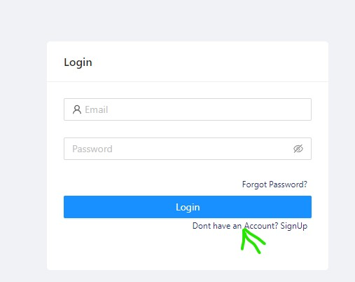
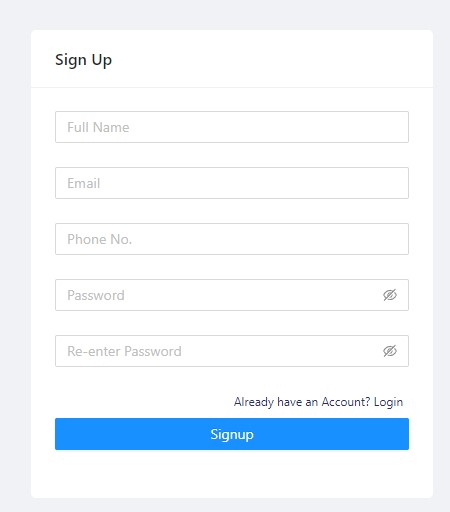
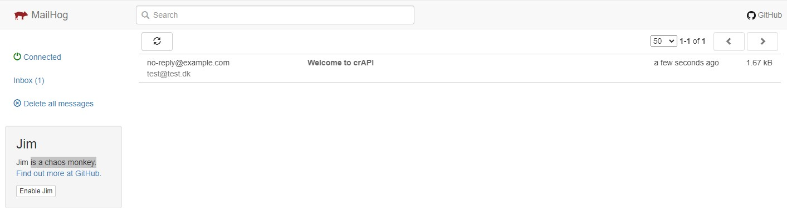
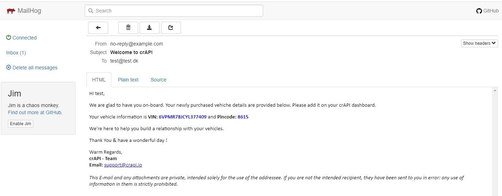
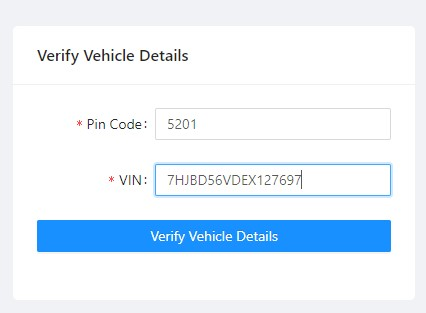
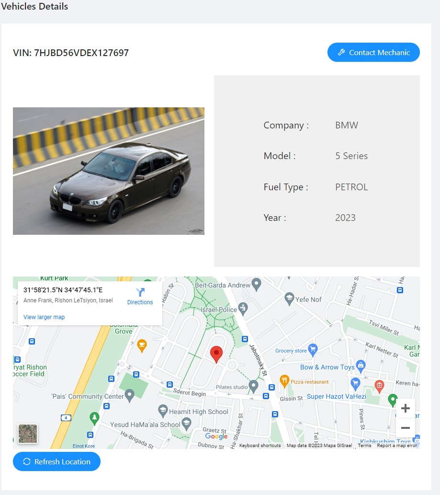

# Getting to know the application

## prerequisite
The hackerlab setup must be comleted, as specified in the [Readme file](../README.md)

## The basic application
At the adresse [127.0.0.1:8888](http://127.0.0.1:8888/login) the main application is available.
You must first sign up with at user account before entering the site.  
  

  

Once you have authenticated in the log in screen, you will be presented with the
main page. With 3 available tabs in the top of the screen. You can now navigate and
explorer the application.  

After the signup you can alsp go to the mailHoq service at [http://127.0.0.1:8025/](http://127.0.0.1:8025/),
which is an email simulations service which can be used throughout the exploitation of crAPI.  
  
  
  

You should note down the VIN number and the Pincode from the welcome mail, as these are needed
for adding a car in the applications dashboard.  
  
  
  

Afterwards you enter the VIN number and Pin code
  
  
  
You should now be able to see the vehicle image, details and location.  
  
  

This is the basic operation of the application, from the end users perspective.
You should now spend some time exploring the application on your own.

