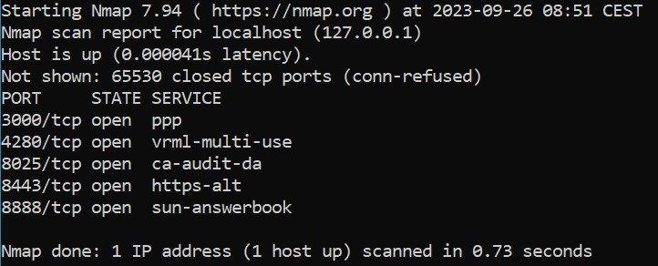

# 🔎 Active Reconnaissance with crAPI

### 🎯 Objective
Understand the role of active reconnaissance in API testing.  
Learn how to discover attack surfaces using tools like Nmap, Gobuster, and ZAP.  
Identify exposed ports, services, and undocumented URL paths that may be vulnerable in real-world environments.

---

Active reconnaissance is about identifying the attack surfaces of a system.  
In these exercises, you will begin by first scanning all the ports of a host and identifying running services.  
Afterwards, you will enumerate crAPI to determine available URL paths.

> 🛡️ **Why this matters in the real world:**  
> Reconnaissance is often the first phase in a real attack.  
> Testers use it to uncover legacy endpoints, undocumented features, and exposed services — before attackers do.  
> Understanding how to perform and interpret scans is a critical step in both offensive and defensive API security.

## Prerequisites

The [setup of the lab](../README.md) should be completed.

The wordlists from [SecLists](https://www.kali.org/tools/seclists/) should be installed  
along with [Gobuster](https://www.kali.org/tools/gobuster/) on a Kali Linux instance  
(I use [Kali](https://www.kali.org/docs/wsl/wsl-preparations/) on WSL for convenience).

If you use Kali with WSL, you can simply scan the loopback address (unless default settings have been changed).  
If you use a virtual machine, ensure that a NAT is configured between the host and VM.

Wordlist paths in WSL:
- `/usr/share/wordlists/seclists/Discovery/Web-Content/common.txt`
- `/usr/share/wordlists/seclists/Discovery/Web-Content/quickhits.txt`

To familiarize yourself with Gobuster, you can watch this [intro tutorial](https://www.youtube.com/watch?v=HjXNK-mYwDQ)

In the Nmap exercises, all output is sent to XML files. Review these files with any text editor —  
I recommend [VS Code](https://code.visualstudio.com/). If using Kali via WSL, you can open a file in VS Code using:
```
code <filename>
```
If this doesn't work, follow the [WSL integration guide](https://code.visualstudio.com/docs/remote/wsl).

---

## 1 – Nmap: Full Port Scan

Use [Nmap](https://nmap.org/) to [scan all ports](https://nmap.org/book/man-port-specification.html) and output the results to an [XML file](https://nmap.org/book/man-output.html).  
This will give you a complete overview of all available ports on the host and the name of the service running on each.

If you are using the setup provided by this repository, your console output will look somewhat like this:  


> 💡 **Hint:** Look for the `-p-` option in the port specification docs and `-oX` in the output options to construct the full command.

> 💡 **Tip: Use a clear naming convention**  
> To stay organized, name your Nmap output files descriptively.  
> For example:  
> - `nmap_full.xml` for your full port scan  
> - `nmap_services.xml` for your version detection scan  
> This helps you keep track of multiple scan results during larger investigations.

---

## 2 – Nmap: Service Version Detection
Use [Nmap](https://nmap.org/) to perform a scan with [default scripts and version detection](https://explainshell.com/explain?cmd=nmap+-sC+-sV+-v+), saving the results to an XML file.

The output will likely be too large to read directly in the terminal. Open the XML file using a text editor like VS Code.

Try to identify which ports belong to Juice Shop and which to crAPI.  
You already know this from the Docker setup, but here the goal is to **practice interpreting scan results like a security analyst**.

> 💡 **Hint:** Explore the docs for `-sC` (script scan), `-sV` (version detection), and `-oX` (XML output).

---

## 3 – Enumerating crAPI with Gobuster and the Wordlist `common.txt`

Use the enumeration tool [Gobuster](https://www.kali.org/tools/gobuster/) with the wordlist `common.txt` from [SecLists](https://www.kali.org/tools/seclists/) to discover available URL paths.

You will likely run into two issues:
- crAPI uses a **self-signed TLS certificate** – configure Gobuster to [skip TLS verification](https://3os.org/penetration-testing/cheatsheets/gobuster-cheatsheet/#dir-mode-options).
- crAPI returns **HTTP 200** even for invalid paths, causing **false positives** — responses that appear valid to the scanner but actually aren’t. You’ll need to exclude these default responses based on their content length.

> 🧪 **Tip: Finding the default response length**  
> To exclude false positives, you first need to determine how long crAPI’s default (invalid) response is.  
> Try sending a request to a fake path like this:
> ```bash
> curl -k -i https://127.0.0.1:8443/thispathshouldnotexist
> ```
> Look at the `Content-Length` in the response headers, or count the number of characters in the response body.  
> You'll use this value when configuring your scan (see Gobuster documentation for how).

Gobuster is a highly aggressive scanner and generates significant traffic — making it easily detectable by intrusion detection systems (IDS).  
To reduce scan noise, consider using a [delay option](https://hackertarget.com/gobuster-tutorial/) between requests.

🧪 Perform the following:
- Run Gobuster against crAPI with the `common.txt` wordlist. **Remember to use HTTPS.**
- Record all paths that return status codes `200` or `300` into a file named `crAPI_wordlist.txt`.

> 💡 **Tip: Name your wordlist files clearly**  
> Save the valid paths discovered with Gobuster into a file named `gobuster_common.txt`,  
> or use a central file like `crAPI_wordlist.txt` to consolidate results from multiple scans.

Gobuster is a highly aggressive scanner and generates significant traffic — making it easily detectable by intrusion detection systems (IDS).  
To reduce scan noise, consider using a [delay option](https://hackertarget.com/gobuster-tutorial/) between requests.

🧪 Perform the following:
- Run Gobuster against crAPI with the `common.txt` wordlist. **Remember to use HTTPS.**
- Record all paths that return status codes `200` or `300` into a file named `crAPI_wordlist.txt`.

---

## 4 – Enumerating crAPI with Gobuster and the Wordlist `quickhits.txt`

Repeat the process from step 3, but now use the `quickhits.txt` wordlist.

🧪 Perform the following:
- Run Gobuster with the `quickhits.txt` wordlist.
- Append all positive responses (200s and 300s) to your `crAPI_wordlist.txt`.
- One path reveals a potential vulnerability — can you spot it? (No exploitation needed — just identify it.)

> 💡 Hint: Look for endpoints that return more information than expected — or ones that suggest admin-level or internal access.
> 💡 Hint: Look for paths that suggest admin interfaces, debugging tools, internal documentation, or unexpected exposure of data.

> 📁 **Tip:** You can save results from this scan in a separate file like `gobuster_quickhits.txt`,  
> or continue appending them to `crAPI_wordlist.txt` for a comprehensive path list.

Your wordlist now reflects verified paths for crAPI. It’s a valuable tool for future scans.

---

## 5 – Enumerating crAPI with ZAP

[OWASP ZAP](https://www.zaproxy.org/) is a free and open-source web analysis tool.  
Unlike [Burp Suite](https://portswigger.net/burp), ZAP provides full functionality without requiring a paid license.

You’ll use ZAP’s automated scanning to map crAPI and detect potential issues.

🧪 Perform the following:
- Run an **automated scan** using the **AJAX spider**.
- Review the **Site Tree** in the left pane — what do you learn?
- Review the **Alerts** — do any match vulnerabilities from step 4?
- Explore the **AJAX Spider** pane — what information does it reveal?

---

### 🧠 Reflect & Discuss

1. What types of services and ports did you discover?  
2. Which tool gave you the most useful information about crAPI’s structure — and why?  
3. How could an attacker use the discovered endpoints to plan a more targeted attack?  
4. If an endpoint always returns 200 OK, how can that mislead automation tools like Gobuster?  
5. How would you explain the purpose of active reconnaissance to a non-technical stakeholder?  
6. How did ZAP's results compare with Gobuster and Nmap? What did it reveal that the other tools didn’t — and vice versa?

---

⚖️ **Ethical Reminder**

Tools like Gobuster, Nmap, and ZAP generate significant amounts of traffic and can unintentionally cause service disruptions or trigger alarms.  
Always conduct scanning **only** in isolated test environments where you have **explicit authorization**.  
Never scan production systems, client infrastructure, or unknown networks without proper permission.
