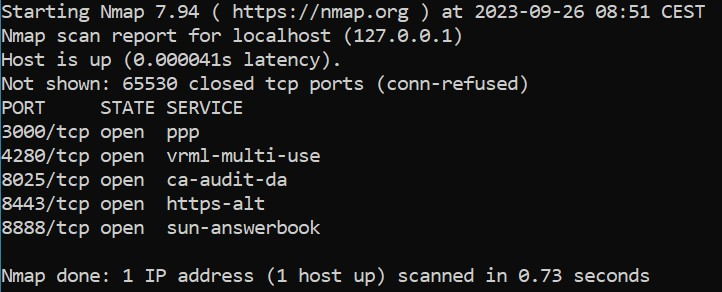

# 🔎 Active Reconnaissance with crAPI

### 🎯 Objective
Understand the role of active reconnaissance in API testing.  
Learn how to discover attack surfaces using tools like Nmap and Gobuster. 
Identify exposed ports, services, and undocumented URL paths that may be vulnerable in real-world environments.

---

Active reconnaissance is about identifying the attack surfaces of a system.  
In these exercises, you will begin by scanning all ports on a host and identifying running services.  
Afterwards, you will enumerate crAPI to determine available URL paths.

---
   
> ⚠️ **Scope and Authorization**
>
> This exercise must only be performed against the local lab environment.
>
> Unless your lab setup explicitly specifies otherwise, all scanning and enumeration should remain within:
>
> `127.0.0.1`
>
> Do **not** replace the target with public websites, external IP addresses, or systems you do not own or have explicit permission to test.
>
> For example, do not run Nmap, Gobuster, or similar reconnaissance tools against domains such as `google.com`, `github.com`, or other Internet-facing services as part of this exercise.
>
> During enumeration, you may encounter paths, parameters, redirects, or wordlist entries that contain external URLs. Do not intentionally follow, probe, or modify these in a way that sends testing traffic to external systems.
>
> Keep all testing inside the authorized lab environment.
  
---

> 🛡️ **Why this matters in the real world:**  
> Reconnaissance is often the first phase in a real attack.  
> Testers use it to uncover legacy endpoints, undocumented features, and exposed services — before attackers do.  
> Understanding how to perform and interpret scans is a critical step in both offensive and defensive API security.

## Prerequisites

The [setup of the lab](../README.md) should be completed.
  
All the tools are executed on Kali Linux. I use [Kali](https://www.kali.org/docs/wsl/wsl-preparations/) on WSL for convenience,
but any Kali Linux instance should work.  
> _When using Kali Linux on WSL, the services from the Docker environment should be accessible through the loopback interface (127.0.0.1)_

The wordlists from [SecLists](https://www.kali.org/tools/seclists/) should be installed along with [Gobuster](https://www.kali.org/tools/gobuster/) on a Kali Linux instance.

If you use Kali with WSL, you can simply scan the loopback address (unless default settings have been changed).  
If you use a virtual machine, ensure that a NAT is configured between the host and VM.

Wordlist paths in Kali WSL are:
- `/usr/share/seclists/Discovery/Web-Content/common.txt`
- `/usr/share/seclists/Discovery/Web-Content/api/api-endpoints.txt`

To familiarize yourself with Gobuster, you can watch this [intro tutorial](https://www.youtube.com/watch?v=HjXNK-mYwDQ)

In the Nmap exercises, all output is sent to XML files. Review these files with any text editor —  
I recommend [VS Code](https://code.visualstudio.com/). If using Kali via WSL, you can open a file in VS Code using:
```
code <filename>
```
If this doesn't work, follow the [WSL integration guide](https://code.visualstudio.com/docs/remote/wsl).

---

## 1 – Nmap: Full Port Scan

Use [Nmap](https://nmap.org/) to [scan all ports](https://nmap.org/book/man-port-specification.html) and output the results to an [XML file](https://nmap.org/book/man-output.html).  
This will give you a complete overview of all available ports on the host and the name of the service running on each.

If you are using the setup provided by this repository, your console output will look somewhat like this:  


> 💡 **Hint:** Look for the `-p-` option in the port specification docs and `-oX` in the output options to construct the full command.

> 💡 **Tip: Use a clear naming convention**  
> To stay organized, name your Nmap output files descriptively.  
> For example:  
> - `nmap_full.xml` for your full port scan  
> - `nmap_services.xml` for your version detection scan  
> This helps you keep track of multiple scan results during larger investigations.

---

## 2 – Nmap: Service Version Detection
Use [Nmap](https://nmap.org/) to perform a scan with [default scripts and version detection](https://explainshell.com/explain?cmd=nmap+-sC+-sV+-v+), saving the results to an XML file.

The output will likely be too large to read directly in the terminal. Open the XML file using a text editor like VS Code.

Try to identify which ports belong to Juice Shop and which to crAPI.  
You already know this from the Docker setup, but here the goal is to **practice interpreting scan results like a security analyst**.

> 💡 **Hint:** Explore the docs for `-sC` (script scan), `-sV` (version detection), and `-oX` (XML output).

---

## 3 – Enumerating crAPI with Gobuster and the Wordlist `common.txt`

Use the enumeration tool [Gobuster](https://www.kali.org/tools/gobuster/) with the wordlist `common.txt` from [SecLists](https://www.kali.org/tools/seclists/) to discover available URL paths.

You will likely run into two issues:
- crAPI uses a **self-signed TLS certificate** – configure Gobuster to [skip TLS verification](https://3os.org/penetration-testing/cheatsheets/gobuster-cheatsheet/#dir-mode-options).
- crAPI returns **HTTP 200** even for invalid paths, causing **false positives** — responses that appear valid to the scanner but actually aren’t. You’ll need to exclude these default responses based on their content length.

> 🧪 **Tip: Finding the default response length**  
> To exclude false positives, you first need to determine how long crAPI’s default (invalid) response is.  
> Try sending a request to a fake path like this:
> ```bash
> curl -k -i https://127.0.0.1:8443/thispathshouldnotexist
> ```
> Look at the `Content-Length` in the response headers, or count the number of characters in the response body.  
> You'll use this value when configuring your scan (see Gobuster documentation for how).

Gobuster is a highly aggressive scanner and generates significant traffic — making it easily detectable by intrusion detection systems (IDS).  
To reduce scan noise, consider using a [delay option](https://hackertarget.com/gobuster-tutorial/) between requests.

🧪 Perform the following:
  
- Run Gobuster against crAPI with the `common.txt` wordlist. **Remember to use HTTPS.**
- Record all paths that return status codes `200` or `300` into a file named `crAPI_wordlist.txt`.
- Examine the discovered paths and identify whether any expose information that should not normally be publicly accessible.
  
> 💡 **Hint:** Try opening interesting discovered paths directly in your browser or requesting them with `curl`.  
> What does the response reveal, and does the content appear appropriate for a publicly accessible resource?
  
> 💡 **Tip: Name your wordlist files clearly**  
> Save the valid paths discovered with Gobuster into a file named `gobuster_common.txt`,  
> or use a central file like `crAPI_wordlist.txt` to consolidate results from multiple scans.

---

## 4 – Continue Enumerating Discovered Paths with `common.txt`

The previous Gobuster scan identified several paths within crAPI.

A discovered path may itself contain additional resources that are not visible when only enumerating the application root.
  
> ⚠️ **Stay within scope:**  
> When adding discovered paths to the target URL, keep the target host as `127.0.0.1`.  
> Only enumerate paths belonging to the local crAPI lab. Do not substitute external domains or IP addresses.
  
🧪 Perform the following:
  
- Review the paths discovered in step 3.

- Choose one or more interesting paths and use Gobuster with `common.txt` to enumerate them further.

- Add the discovered path to the target URL before running the scan.

- Investigate and handle any responses that prevent Gobuster from completing the enumeration.

- Examine any newly discovered paths.

- Add useful findings to your `crAPI_wordlist.txt`.

> 💡 **Hint:** Not every discovered path will contain additional resources.

> 💡 **Hint:** Different parts of the application may respond differently to invalid requests.

> 📁 **Tip:** You can save the results from these scans in separate files, or continue adding verified paths to your `crAPI_wordlist.txt`.

Continue enumeration where your findings suggest that additional resources may exist.

---

## 5 – Enumerating crAPI with an API-Specific Wordlist
  
> ⚠️ **Scope reminder:**  
> Wordlists may contain entries that resemble external URLs or reference public services. Keep your enumeration targeted at the local crAPI instance and do not intentionally send reconnaissance traffic to external systems.

So far, you have used the general-purpose `common.txt` wordlist to discover and further enumerate paths within crAPI.

SecLists also contains wordlists designed specifically for API endpoint discovery.

Use the following wordlist:

`/usr/share/seclists/Discovery/Web-Content/api/api-endpoints.txt`

🧪 Perform the following:
  
- Use Gobuster with the `api-endpoints.txt` wordlist against paths discovered during the previous exercises.

- Investigate and handle any responses that prevent Gobuster from completing the enumeration.

- Compare the results with those obtained using `common.txt`.

- Examine any newly discovered endpoints and their HTTP responses.

- Add useful findings to your `crAPI_wordlist.txt`.

> 💡 **Hint:** Different wordlists may reveal different parts of an application's attack surface.

> 💡 **Hint:** A discovered endpoint does not necessarily need to return `200 OK` to be interesting.

> 📁 **Tip:** You can save the results from these scans in separate files such as `gobuster_api.txt`, or continue adding verified paths to your `crAPI_wordlist.txt`.

Compare what you discovered using the general-purpose and API-specific wordlists. Consider why one wordlist may discover endpoints that the other does not.

---

### 🧠 Reflect & Discuss

1. What types of services and ports did you discover?  
2. Which tool gave you the most useful information about crAPI’s structure — and why?  
3. How could an attacker use the discovered endpoints to plan a more targeted attack?  
4. If an endpoint always returns 200 OK, how can that mislead automation tools like Gobuster?  
5. How would you explain the purpose of active reconnaissance to a non-technical stakeholder? 

---
  
### ✅ Learning Check

After completing this exercise, you should be able to say:

- [ ] I can identify exposed ports and services using Nmap.
- [ ] I can enumerate from the root path of a web application.
- [ ] I can continue enumeration from discovered subpaths.
- [ ] I can recognize and investigate false-positive responses during enumeration.
- [ ] I can choose between a general-purpose and an API-specific wordlist.
- [ ] I can use an API-specific wordlist to discover API endpoints.
- [ ] I can compare results from different wordlists.
- [ ] I can investigate HTTP responses to determine whether a discovered path is interesting.
- [ ] I can build and maintain a list of discovered paths for later testing.

If you can perform these tasks without following the exercise step-by-step, you have achieved the main learning objectives.
---
  
## ⚖️ Ethical Reminder

Tools such as Gobuster and Nmap can generate significant amounts of traffic and may unintentionally cause service disruptions or trigger security controls.

Only use these tools against systems you own or systems for which you have explicit authorization to test.

For this exercise, keep all reconnaissance within the local lab environment (`127.0.0.1`) unless your instructor or lab documentation explicitly defines another authorized target.

Never scan public websites, Internet-facing systems, client infrastructure, or unknown networks without explicit permission.
